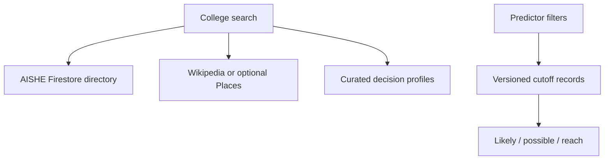

# EduDiscover

EduDiscover is a no-payment college discovery and admission-planning SaaS foundation for India. It separates broad institution discovery from verified decision data so a visitor can find a real college without the product pretending that every result already has trustworthy fees or cutoffs.

> Admission notice: no software can predict admission with 100% certainty. Counselling results change by year, program, category, quota, round, seat availability and policy. The predictor provides deterministic planning bands and always requires official-source verification.

## Product data model

| Data lane | Firestore collection | Purpose | Saved when a visitor searches? |
| --- | --- | --- | --- |
| India-wide directory | `collegeDirectory` | AISHE-backed institution identity, state/UT, city/district and source | No |
| Decision profiles | `colleges` | Curated fees, courses, exams, rankings, facilities and comparisons | No |
| Admission evidence | `cutoffRecords` | Versioned exam/category/course/quota/round/year cutoff rows | No |
| Private account data | `users/{uid}/savedColleges` | A signed-in visitor's shortlist | Only when the visitor presses Save |

Public search combines an imported Firestore directory with attributed Wikipedia discovery. Google Places is an optional enrichment provider. External results are returned on demand and are never copied into a user's account.



## Current capabilities

- College-name search and state/UT browsing with no image hotlinking
- Public directory results clearly separated from full decision profiles
- Filters for study area, institution type, exam, fees, rating and sort order
- Firebase email/password, Google sign-in, password reset and private saved colleges
- Comparison of up to three decision profiles
- Versioned, paginated cutoff matching by exam, category, state, course, quota and year
- Public questions with authenticated posting
- Deny-by-default Firestore rules and admin-only catalog writes
- No checkout, subscription, Stripe or payment flow

The repository includes 19 reference profiles only as a safe local fallback. A production catalog becomes broad after an operator imports an official directory and verified cutoff datasets.

## Technology

- Next.js 16.2 App Router with React 19 and TypeScript
- Tailwind CSS 4
- Firebase Authentication and Cloud Firestore
- Zustand for transient compare/recent state
- Node test runner for predictor and security guardrails

## 1. Clone and validate

```bash
git clone https://github.com/sejal-Kamble18/college-discovery-platform.git
cd college-discovery-platform
git checkout -b feat/your-feature
npm ci
npm run check
```

For local development:

```bash
cp .env.example .env.local
npm run dev
```

PowerShell:

```powershell
Copy-Item .env.example .env.local
npm run dev
```

Open `http://localhost:3000`. Public reference profiles and Wikipedia discovery work without Firebase. Firebase is required for Google login, saved colleges, Firestore directory records and verified cutoff records.

## 2. Configure Firebase and Google login

`auth/invalid-api-key` means the Firebase Web app values are missing, placeholder text, or copied from different projects.

1. Create or select a project in [Firebase Console](https://console.firebase.google.com/).
2. Open **Project settings → General → Your apps** and register a Web app.
3. Copy the complete Web app configuration into `.env.local`:

```env
NEXT_PUBLIC_FIREBASE_API_KEY=AIza...
NEXT_PUBLIC_FIREBASE_AUTH_DOMAIN=your-project.firebaseapp.com
NEXT_PUBLIC_FIREBASE_PROJECT_ID=your-project
NEXT_PUBLIC_FIREBASE_STORAGE_BUCKET=your-project.firebasestorage.app
NEXT_PUBLIC_FIREBASE_MESSAGING_SENDER_ID=123456789
NEXT_PUBLIC_FIREBASE_APP_ID=1:123456789:web:abcdef
COLLEGE_QUERY_SCAN_LIMIT=250
PREDICTOR_QUERY_LIMIT=500
```

4. In **Authentication → Sign-in method**, enable **Email/Password** and **Google**, and select a support email.
5. In **Authentication → Settings → Authorized domains**, add `localhost`, the production hostname and one stable staging hostname.
6. Create Cloud Firestore in production mode.
7. Restart the development server after changing environment values.

If Google authentication succeeds but profile synchronization fails, deploy the included Firestore rules and confirm that the signed-in user can create `users/{uid}`. Authentication remains the source of truth; a temporary profile-write failure is logged separately instead of being reported as a false OAuth failure.

## 3. Deploy Firestore rules and indexes

```bash
npx firebase-tools login
npx firebase-tools use --add
npx firebase-tools deploy --only firestore:rules,firestore:indexes
```

The rules allow public reads of directory, profile, cutoff and discussion content; user-owned access to private account data; and admin-only writes to public catalog collections.

## 4. Load a real India-wide college directory

Use an official source such as the [AISHE institution directory/dashboard](https://dashboard.aishe.gov.in/) or an official [AISHE final report export](https://aishe.gov.in/aishe-final-report/). Do not fabricate thousands of records with an AI model.

The importer accepts normalized UTF-8 CSV or JSON. Recommended CSV columns are:

```csv
aisheCode,name,state,district,city,type,management,website,sourceUrl,sourceAuthority,sourceYear
```

Required values are `name`, `state`, `sourceUrl` and `sourceYear`. `sourceUrl`, `sourceAuthority` and `sourceYear` may instead be supplied once through environment variables. Convert the official spreadsheet to the normalized columns, review duplicate/closed institutions, then run:

```bash
DIRECTORY_DATA_PATH=./data/aishe-directory.csv \
DIRECTORY_SOURCE_URL=https://dashboard.aishe.gov.in/ \
DIRECTORY_SOURCE_AUTHORITY=AISHE \
DIRECTORY_SOURCE_YEAR=2024 \
CONFIRM_DIRECTORY_IMPORT=verified \
npm run import:directory
```

PowerShell:

```powershell
$env:DIRECTORY_DATA_PATH=".\data\aishe-directory.csv"
$env:DIRECTORY_SOURCE_URL="https://dashboard.aishe.gov.in/"
$env:DIRECTORY_SOURCE_AUTHORITY="AISHE"
$env:DIRECTORY_SOURCE_YEAR="2024"
$env:CONFIRM_DIRECTORY_IMPORT="verified"
npm run import:directory
```

The script validates states/UTs and provenance, generates prefix search tokens, rejects duplicate IDs, and imports in batches of 400. Searches query `collegeDirectory` by name token and/or state, then merge the results with public discovery. The search response is not persisted again.

## 5. Curated decision profiles

The directory answers “does this institution exist and where is it?” Full cards and comparisons require audited `colleges` documents. Set `COLLEGE_DATA_PATH` to a reviewed JSON array matching `types/college.ts`, keep `serviceAccountKey.json` outside Git, then run:

```bash
COLLEGE_DATA_PATH=./data/verified-colleges.json \
CONFIRM_COLLEGE_IMPORT=verified \
npm run import:colleges
```

Verify every fee, ranking, program, placement, seat and date against its responsible official authority. `isVerified` should remain false until the complete displayed profile has passed review.

## 6. Versioned predictor dataset

Each `cutoffRecords` document represents one exam/category/course/quota/round/year boundary:

```json
{
  "id": "iitb-cse-jee-advanced-general-ai-r1-2025",
  "collegeId": "iit-bombay",
  "collegeSlug": "iit-bombay",
  "collegeName": "Indian Institute of Technology Bombay",
  "shortName": "IIT Bombay",
  "city": "Mumbai",
  "state": "Maharashtra",
  "exam": "JEE Advanced",
  "category": "general",
  "mode": "rank",
  "cutoff": 68,
  "year": 2025,
  "courseName": "Computer Science and Engineering",
  "round": "Round 1",
  "quota": "All India",
  "sourceAuthority": "JoSAA",
  "sourceUrl": "https://example.gov.in/official-cutoff-page",
  "datasetVersion": "josaa-2025-r1",
  "isVerified": true
}
```

Use the actual official counselling URL in place of the example. The importer refuses records without a source, dataset version or `isVerified: true`:

```bash
CUTOFF_DATA_PATH=./data/cutoff-records.json \
CONFIRM_CUTOFF_IMPORT=verified \
npm run import:cutoffs
```

The API is paginated and never returns a random probability:

```http
POST /api/predict
Content-Type: application/json

{
  "exam": "JEE Advanced",
  "category": "general",
  "value": 400,
  "state": "Maharashtra",
  "course": "Computer Science",
  "quota": "All India",
  "year": 2025,
  "page": 1,
  "pageSize": 20
}
```

The engine computes the distance from each stored threshold and labels it `likely`, `possible` or `reach`. These are explainable planning ranges, not guarantees.

## 7. Live search API without saving results

```http
GET /api/colleges/search?q=savitribai&state=Maharashtra
GET /api/colleges/search?state=Kerala
```

Search order:

1. Query the imported `collegeDirectory` collection when Firebase is configured.
2. Query attributed Wikipedia institution pages as a zero-key discovery fallback.
3. Optionally enrich with Google Places when a server-only key exists.
4. De-duplicate results and return at most 30 matches.

Google Places can provide public address, phone, rating, maps and website data, but it may require billing in the operator's Google Cloud project. EduDiscover works without it. If used, enable **Places API (New)**, restrict the key, set quotas, and add only this server-side variable:

```env
GOOGLE_PLACES_API_KEY=your_restricted_server_key
```

Never prefix that variable with `NEXT_PUBLIC_`.

## 8. Image policy

The application does not request or render remote college covers or logos. Cards and profile headers use CSS initials and category colors, so broken hotlinks cannot leave empty image boxes or add third-party tracking requests. Legacy media fields may remain in imported documents for compatibility but are not included in list payloads.

## 9. Production deployment

1. Import the repository into Vercel or another Next.js host.
2. Add all Firebase Web app variables to the correct Development, Preview and Production environments.
3. Deploy Firestore rules and indexes with Firebase CLI.
4. Add production/staging hostnames to Firebase Authorized domains.
5. Import the audited directory, profile and cutoff datasets from a trusted workstation.
6. Test signup, Google login, password reset, save/remove, search, state filters, predictor pages and mobile navigation.

No payment provider or commerce environment variable is required.

## Validation

```bash
npm run lint
npm run typecheck
npm test
npm run build
# or all at once
npm run check
```

## Production-readiness checklist

- [ ] Replace reference academic records with source-provenance data.
- [ ] Test Firestore rules with the Firebase Emulator Suite.
- [ ] Configure Firebase App Check and provider quotas.
- [ ] Add distributed rate limiting before multi-instance high traffic.
- [ ] Add privacy-safe monitoring, analytics and alerting.
- [ ] Implement account deletion and community moderation workflows.
- [ ] Back up Firestore and document restoration procedures.
- [ ] Move high-volume full-text catalog search to a maintained search index when Firestore token search no longer meets scale or typo-tolerance needs.
- [ ] Complete accessibility, security, performance and cross-browser reviews.

## Useful commands

```bash
npm run dev
npm run lint
npm run typecheck
npm test
npm run build
npm run check
npm run import:directory
npm run import:colleges
npm run import:cutoffs
npm run firebase:deploy
```

## Maintainer

Sejal Kamble — [GitHub](https://github.com/sejal-Kamble18)
