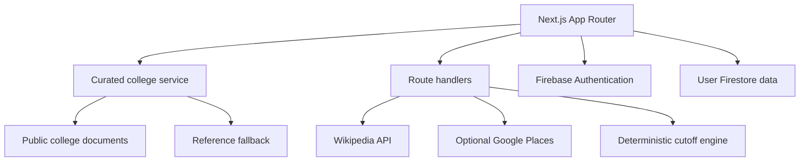

# EduDiscover

EduDiscover is a Next.js college research platform for India. It combines a curated Firestore-backed directory with on-demand external university search, account-synchronized shortlists, side-by-side comparison, community questions, and a transparent cutoff-matching tool.

The product contains no checkout, subscription, or payment feature.

> Data notice: bundled seed profiles and their fees, rankings, placements, seats, ratings, and cutoffs are labelled as reference data until an administrator verifies every field against an official source. The predictor is a planning aid, not an admission guarantee.

## What works

| Capability | Implementation |
| --- | --- |
| Curated college browse | Server-rendered Firestore REST reads with a bundled reference-data fallback |
| Live college search | Attributed Wikipedia summaries by default; optional Google Places enrichment |
| Filters | Search, state, study area, institution type, exam, fee, rating, and sort |
| College profiles | Overview, reference courses/fees, facilities, placements, and official website |
| Compare | Up to three colleges in client-side comparison state |
| Saved colleges | Private Firestore subcollection synchronized to the signed-in user |
| Authentication | Firebase email/password, Google sign-in, sign-out, and password reset |
| Community | Public question feed with authenticated Firestore-backed posting |
| Predictor | Deterministic comparison against stored exam/category cutoffs; no randomness |
| Security | Deny-by-default Firestore rules and admin-only curated-college writes |
| Legal/setup | Privacy, terms, and deployment-setup pages |

## Architecture



Live external search results are fetched only when a visitor searches. The application does not write those external profiles to Firestore.

## Technology

- Next.js 16.2 with the App Router and Webpack
- React 19 and TypeScript
- Tailwind CSS 4
- Firebase Authentication and Cloud Firestore
- Zustand for transient compare/recent-view state
- Node's test runner for predictor tests

## 1. Clone and create the feature branch

```bash
git clone https://github.com/sejal-Kamble18/college-discovery-platform.git
cd college-discovery-platform
git checkout -b feat/live-college-search
npm ci
```

If you already cloned the project and created the branch:

```bash
git status
git branch --show-current
git pull --ff-only origin main
```

Do not run `npm audit fix --force` without reviewing the breaking dependency changes.

## 2. Run the public experience without Firebase

```bash
cp .env.example .env.local
npm run dev
```

PowerShell equivalent:

```powershell
Copy-Item .env.example .env.local
npm run dev
```

Open `http://localhost:3000`. Public browsing, comparison, reference profiles, the predictor, and basic live university search work without Firebase credentials. Account features show a setup link until Firebase is configured.

## 3. Configure Firebase correctly

The error `Firebase: Error (auth/invalid-api-key)` means the web API key in `.env.local` is missing, copied incorrectly, or still placeholder text.

1. Open [Firebase Console](https://console.firebase.google.com/) and create or select a project.
2. Open **Project settings → General → Your apps**.
3. Create a Web app if one does not exist.
4. Copy the values from the displayed `firebaseConfig` object into `.env.local`:

```env
NEXT_PUBLIC_FIREBASE_API_KEY=AIza...
NEXT_PUBLIC_FIREBASE_AUTH_DOMAIN=your-project.firebaseapp.com
NEXT_PUBLIC_FIREBASE_PROJECT_ID=your-project
NEXT_PUBLIC_FIREBASE_STORAGE_BUCKET=your-project.firebasestorage.app
NEXT_PUBLIC_FIREBASE_MESSAGING_SENDER_ID=123456789
NEXT_PUBLIC_FIREBASE_APP_ID=1:123456789:web:abcdef
COLLEGE_QUERY_SCAN_LIMIT=250
```

5. In **Authentication → Sign-in method**, enable **Email/Password** and **Google**.
6. In **Authentication → Settings → Authorized domains**, add `localhost` and every deployed domain.
7. In **Firestore Database**, create the database in production mode and choose the appropriate region.
8. Restart `npm run dev`; Next.js reads environment variables only when the server starts.

Firebase web configuration is used by the browser and is not an admin credential. Security depends on Firestore rules. Still keep environment files out of Git and restrict the Google Cloud API key to the APIs this project needs.

## 4. Deploy Firestore rules and indexes

The repository includes `firebase.json`, `firestore.rules`, and `firestore.indexes.json`.

```bash
npx firebase-tools login
npx firebase-tools use --add
npx firebase-tools deploy --only firestore:rules,firestore:indexes
```

The rules provide:

- public reads for college profiles and community posts;
- account-owner access to user profiles and saved colleges;
- authenticated, validated discussion creation;
- admin-only college writes; and
- a deny-by-default fallback for unspecified collections.

To give an operator admin access, set that user's Firestore profile `role` to `admin` from a trusted Admin SDK process or Firebase Console. Never let the browser promote its own role.

## 5. Live college APIs

### Zero-key default

`GET /api/colleges/search?q=pune` calls the MediaWiki API from the server. It returns matching institution article titles, short Wikipedia summaries, and attributed source links. Wikipedia is a discovery source, not an official academic source; it does not provide trustworthy current fees, cutoffs, courses, placements, or admission rules.

No data from this response is saved by the application.

### Optional richer Google Places results

Google Places can add formatted addresses, map links, phone numbers, public ratings, and websites:

1. Open [Google Cloud Console](https://console.cloud.google.com/).
2. Select the Firebase-linked project or another controlled project.
3. Enable **Places API (New)**.
4. Create an API key, restrict it to Places API, configure quotas, and monitor usage.
5. Add the key only to the server environment:

```env
GOOGLE_PLACES_API_KEY=your_server_key
```

Never name this variable `NEXT_PUBLIC_GOOGLE_PLACES_API_KEY`; that would expose it in browser JavaScript. Google may require billing for Places usage even though EduDiscover itself has no payment feature. Leave this variable empty to keep the zero-key Wikipedia mode.

The API contract is:

```http
GET /api/colleges/search?q=college%20name
```

Queries must be 3–100 characters. Provider errors are converted to safe public messages, requests time out, and responses are not stored by the app.

## 6. Predictor API

```http
POST /api/predict
Content-Type: application/json

{
  "exam": "JEE Advanced",
  "category": "general",
  "value": 400
}
```

Supported inputs are JEE Advanced rank, JEE Main percentile, NEET score, CAT percentile, and BITSAT score. The engine compares the input against stored category thresholds and returns `strong`, `possible`, or `reach`. It uses no random number and makes no admission guarantee.

## 7. Firestore data model

```text
colleges/{collegeId}
users/{uid}
users/{uid}/savedColleges/{collegeId}
discussions/{discussionId}
reviews/{reviewId}                 # reserved for moderated reviews
```

User saves contain the lightweight college card snapshot required for the shortlist. Public external-directory results are not placed in these collections.

## 8. Data verification and optional import

The repository's seed dataset is not automatically considered verified. Every seed record is forced to `isVerified: false`, even if an old JSON entry says otherwise.

Before importing a bulk dataset:

1. Confirm institution identity and official website.
2. Record the source URL and retrieval date for every academic field.
3. Remove invented, duplicate, closed, or mislocated institutions.
4. Validate units for fees, packages, scores, percentiles, ranks, years, categories, quotas, courses, and counselling rounds.
5. Test in a separate Firebase project.

The import script deliberately refuses to run without explicit confirmation. If the audited dataset exists at `scripts/data/colleges_10000_seed.json` and a local `serviceAccountKey.json` is present:

```bash
CONFIRM_COLLEGE_IMPORT=verified npm run import:colleges
```

PowerShell:

```powershell
$env:CONFIRM_COLLEGE_IMPORT="verified"
npm run import:colleges
```

`serviceAccountKey.json` is ignored by Git. Never commit or upload it.

## 9. Validate the project

```bash
npm run lint
npm run typecheck
npm test
npm run build
```

Or run the complete gate:

```bash
npm run check
```

Current automated tests cover deterministic rank prediction and cutoff-boundary behavior. Add integration tests against Firebase Emulator Suite before a production launch.

## 10. Deploy

For Vercel:

1. Import this GitHub repository into Vercel.
2. Add all Firebase variables to Development, Preview, and Production as appropriate.
3. Optionally add the server-only Google Places key.
4. Deploy Firestore rules separately with Firebase CLI.
5. Add the final Vercel/custom domains to Firebase Authorized domains.
6. Test signup, Google sign-in, password reset, save/remove, discussion posting, search, predictor, and mobile navigation on the deployed URL.

No payment provider or commerce environment variables are required.

## Production readiness checklist

- [ ] Replace or verify all reference academic records with source provenance.
- [ ] Deploy and test Firestore rules using Firebase Emulator Suite.
- [ ] Configure Firebase App Check for abuse protection.
- [ ] Add API quotas/rate limiting and monitoring for public endpoints.
- [ ] Add error monitoring and privacy-safe analytics if needed.
- [ ] Review privacy/terms for the operator's legal entity and jurisdiction.
- [ ] Add account deletion and community moderation workflows.
- [ ] Back up Firestore and document recovery procedures.
- [ ] Replace the bounded Firestore scan with a dedicated search index before a very large catalog launch.
- [ ] Run accessibility, performance, security, and cross-browser checks.

## Scaling note

The current curated search scans at most `COLLEGE_QUERY_SCAN_LIMIT` public documents on the server and then filters them in memory. This is simple and functional for an early catalog. For thousands of verified colleges and high traffic, use a dedicated search service or maintained search index with cursor pagination rather than increasing the scan limit indefinitely.

## Useful commands

```bash
npm run dev              # local development
npm run lint             # ESLint
npm run typecheck        # TypeScript without emitting files
npm test                 # predictor unit tests
npm run build            # production build
npm start                # serve the production build
npm run check            # full validation gate
npm run firebase:deploy  # deploy rules/indexes with installed Firebase CLI
```

## Contributing

Read [CONTRIBUTING.md](CONTRIBUTING.md), work on a focused branch, run `npm run check`, and open a pull request. Never commit `.env.local`, Google API keys, Firebase service-account keys, or real user data.

## Maintainer

Sejal Kamble — [GitHub](https://github.com/sejal-Kamble18)
